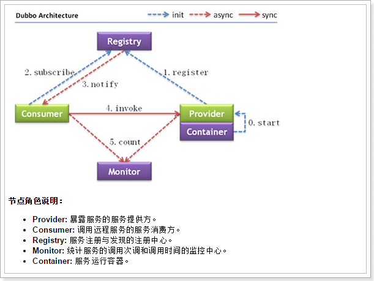
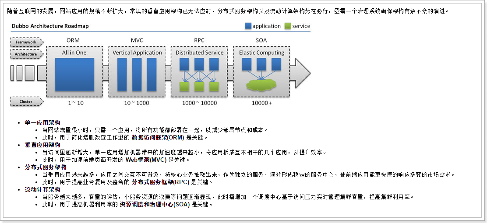

# Dubbo

M：Dubbo跟Zookeeper是什么关系？  

Z：Dubbo是一个RPC远程服务框架，而dubbo建议使用Zookeeper作为服务的注册中心。如下图为Dubbo的使用架构，而其中的Registry则由Zookeeper承担。   

  

Provider是提供者，Consumer是消费者。提供者注册服务到Registry注册中心，消费者通过dubbo从注册中心获取服务列表，再远程调用服务。

M：什么是RPC远程服务呢？

Z：当用户访问量不断增加，我们可能需要将系统进行拆分（例如：前端显示 + 后台数据提取），从而实现负载均衡。但是由于前端和后台是分开的两个系统，它们之间要进行通讯，就需要用到RPC（Remote Procedure Call）。   

    

M：怎么使用dubbo呢？

Z：安装zookeeper作为注册中心（需要JDK环境）

1. 下载[zookeeper](http://mirror.bit.edu.cn/apache/zookeeper/zookeeper-3.4.10/)  
2. 将zookeeper上传到linux服务器，解压``tar -xvf zookeeper-3.4.10.tar.gz ``   
3. 进入解压后的/bin目录，运行``./zkServer.sh start``即可   

#### Zookeeper配置

M：那我要怎么修改zookeeper的配置呢？

Z：进入/conf目录，复制一份配置文件``cp zoo_sample.cfg zoo.cfg``,编辑配置文件即可，简化版如下

```properties
tickTime=2000
initLimit=10
syncLimit=5
dataDir=D:/dubbo/data
clientPort=3010
```

M：配置文件中，``syncLimit=5``是干嘛用的？

Z：设置leader和follwer的响应时间单位，当超时时，就会从服务器列表中移除超时服务器。   

M：那initLimit=10呢？

Z：投票选举新leader的初始化时间。

M：什么是leader（领导者）呢?

Z：客户端提交请求之后，先发送到leader，leader作为接收者，广播到每个server。

M：配置文件中dataDir=/tmp/zookeeper是干嘛用的？

Z：数据持久化路径。

M：那有日志文件吗，怎么设置保存位置？

Z：直接添加``dataLogDir=/home/vlan/zookeeper/log``   

M：怎么设置zookeeper的端口呢？

Z：这里默认的是2181``clientPort=2181``   

#### 提供者搭建  

M：搭建dubbo提供者的步骤？

Z：首先创建maven工程，引入dubbo   

```xml
<project xmlns="http://maven.apache.org/POM/4.0.0" xmlns:xsi="http://www.w3.org/2001/XMLSchema-instance"
         xsi:schemaLocation="http://maven.apache.org/POM/4.0.0 http://maven.apache.org/xsd/maven-4.0.0.xsd">
<modelVersion>4.0.0</modelVersion>
<groupId>cn.itcast.dubbo</groupId>
<artifactId>dubbo-b</artifactId>
<version>1.0.0-SNAPSHOT</version>
<packaging>war</packaging>

<dependencies>
    <!-- dubbo采用spring配置方式，所以需要导入spring容器依赖 -->
    <dependency>
        <groupId>org.springframework</groupId>
        <artifactId>spring-webmvc</artifactId>
        <version>4.1.3.RELEASE</version>
    </dependency>
    <dependency>
        <groupId>org.slf4j</groupId>
        <artifactId>slf4j-log4j12</artifactId>
        <version>1.6.4</version>
    </dependency>

    <dependency>
        <groupId>com.alibaba</groupId>
        <artifactId>dubbo</artifactId>
        <version>2.5.3</version>
        <exclusions>
            <exclusion>
                <!-- 排除传递spring依赖 -->
                <artifactId>spring</artifactId>
                <groupId>org.springframework</groupId>
            </exclusion>
        </exclusions>
    </dependency>
</dependencies>
<build>
    <plugins>
        <plugin>
            <groupId>org.apache.tomcat.maven</groupId>
            <artifactId>tomcat7-maven-plugin</artifactId>
            <version>2.2</version>
            <configuration>
                <port>8081</port>
                <path>/</path>
            </configuration>
        </plugin>
    </plugins>
</build>
</project>
```

M：为什么依赖spring呢？

Z：因为dubbo是在spring上面扩展开发，可以和spring无缝融合。   

M：在依赖dubbo中，为什么要排除传递spring依赖？

Z：因为dubbo中本来就依赖了spring，但是版本太旧，所以需要进行排除，再手动依赖。   

M：dubbo架构的项目中需要什么类呢？

Z：1.model类，2.接口类，3.接口impl实现类   

model类（注意要实现``implements java.io.Serializable``，添加 **serialVersionUID**   ）

```java
package cn.itcast.dubbo.pojo;

// 使用dubbo要求传输的对象必须实现序列化接口
public class User implements java.io.Serializable {

    private static final long serialVersionUID = -7341603933521593227L;

    private Long id;

    private String username;

    private String password;

    private Integer age;
...   
```

接口类

```java
public interface UserService {
    public List<User> queryAll();
}
```

接口实现类

```java
public class UserServiceImpl implements UserService {

    /**
     * 实现查询，这里做模拟实现，不做具体的数据库查询
     */
    public List<User> queryAll() {
        List<User> list = new ArrayList<User>();
        for (int i = 0; i < 10; i++) {
            User user = new User();
            user.setAge(10 + i);
            user.setId(Long.valueOf(i + 1));
            user.setPassword("123456");
            user.setUsername("username_" + i);
            list.add(user);
        }
        return list;
    }

}
```

M：**serialVersionUID** 有什么作用呢？  

Z：在提供者和消费者的通讯之间，两者都有model类。提供者将model进行序列化，而消费者进行反序列化，而其序列化和反序列化的标识就是serialVersionUID，所以serialVersionUID 不能随意进行更改。   

M：那dubbo的配置文件有哪些呢？

Z：dubbo-service.xml 和 web.xml引入配置文件

dubbo-service.xml

```xml
<beans xmlns="http://www.springframework.org/schema/beans"
       xmlns:context="http://www.springframework.org/schema/context" xmlns:p="http://www.springframework.org/schema/p"
       xmlns:aop="http://www.springframework.org/schema/aop" xmlns:tx="http://www.springframework.org/schema/tx"
       xmlns:xsi="http://www.w3.org/2001/XMLSchema-instance" xmlns:dubbo="http://code.alibabatech.com/schema/dubbo"
       xsi:schemaLocation="http://www.springframework.org/schema/beans http://www.springframework.org/schema/beans/spring-beans-4.0.xsd
	http://www.springframework.org/schema/context http://www.springframework.org/schema/context/spring-context-4.0.xsd
	http://www.springframework.org/schema/aop http://www.springframework.org/schema/aop/spring-aop-4.0.xsd http://www.springframework.org/schema/tx http://www.springframework.org/schema/tx/spring-tx-4.0.xsd
	http://code.alibabatech.com/schema/dubbo http://code.alibabatech.com/schema/dubbo/dubbo.xsd">

    <!-- 提供方应用信息，用于计算依赖关系 -->
    <dubbo:application name="dubbo-b-server" />

    <!-- 这里使用的注册中心是zookeeper -->
    <dubbo:registry address="zookeeper://127.0.0.1:2181" client="zkclient"/>

    <!-- 用dubbo协议在20880端口暴露服务 -->
    <dubbo:protocol name="dubbo" port="20880" />

    <!-- 将该接口暴露到dubbo中 -->
    <dubbo:service interface="cn.itcast.dubbo.service.UserService" ref="userServiceImpl" />

    <!-- 将具体的实现类加入到Spring容器中 -->
    <bean id="userServiceImpl" class="cn.itcast.dubbo.service.impl.UserServiceImpl" />
    
</beans>
```

web.xml

```xml
<?xml version="1.0" encoding="UTF-8"?>
<web-app xmlns:xsi="http://www.w3.org/2001/XMLSchema-instance" xmlns="http://java.sun.com/xml/ns/javaee" xsi:schemaLocation="http://java.sun.com/xml/ns/javaee http://java.sun.com/xml/ns/javaee/web-app_2_5.xsd" id="WebApp_ID" version="2.5">
	
	<display-name>dubbo-b</display-name>
	
	<context-param>
		<param-name>contextConfigLocation</param-name>
		<param-value>classpath:dubbo/dubbo-*.xml</param-value>
	</context-param>
	
	<!--Spring的ApplicationContext 载入 -->
	<listener>
		<listener-class>org.springframework.web.context.ContextLoaderListener</listener-class>
	</listener>
	
    <welcome-file-list>
    	<welcome-file>index.jsp</welcome-file>
    </welcome-file-list>

</web-app>
```

M：为什么我引入dubbo-service.xml之后发生报错呢？

Z：可能是缺少XML结构定义文件xsd，添加即可。idea对地址报错，添加报错地址到Settings - Schemas and DTDs - Ignored Schemas and DTDs中即可。

M：有了类和配置文件，怎么将服务注册到注册中心呢？

Z：直接在Tomcat运行该项目即可。

#### 消费者搭建

M：消费者搭建需要什么呢？

Z：与提供者相同（1.model类，2.接口类，3.dubbo配置文件），只是无需web.xml文件和ServiceImpl实现类，而且dubbo-consumer.xml做了改动

```xml
<beans xmlns="http://www.springframework.org/schema/beans"
       xmlns:context="http://www.springframework.org/schema/context" xmlns:p="http://www.springframework.org/schema/p"
       xmlns:aop="http://www.springframework.org/schema/aop" xmlns:tx="http://www.springframework.org/schema/tx"
       xmlns:xsi="http://www.w3.org/2001/XMLSchema-instance" xmlns:dubbo="http://code.alibabatech.com/schema/dubbo"
       xsi:schemaLocation="http://www.springframework.org/schema/beans http://www.springframework.org/schema/beans/spring-beans-4.0.xsd
	http://www.springframework.org/schema/context http://www.springframework.org/schema/context/spring-context-4.0.xsd
	http://www.springframework.org/schema/aop http://www.springframework.org/schema/aop/spring-aop-4.0.xsd http://www.springframework.org/schema/tx http://www.springframework.org/schema/tx/spring-tx-4.0.xsd
	http://code.alibabatech.com/schema/dubbo http://code.alibabatech.com/schema/dubbo/dubbo.xsd">

    <!-- 提供方应用信息，用于计算依赖关系 -->
    <dubbo:application name="dubbo-a-consumer" />

    <!-- 这里使用的注册中心是zookeeper -->
    <dubbo:registry address="zookeeper://127.0.0.1:2181" client="zkclient"/>

    <!-- 从注册中心中查找服务 -->
    <dubbo:reference id="userService" interface="cn.itcast.dubbo.service.UserService"/>

</beans>
```

提供者是用``<dubbo:service>``对接口进行暴露，而消费者是通过``<dubbo:reference>``寻找对应接口。

M：那要怎么实现提供者和消费者之间的连通呢？

Z：打开zookeeper，注册服务和消费服务

1. 打开zookeeper

2. 运行提供者的tomcat，实现服务的注册

3. 通过dubbo注入Service接口，实现相应查询功能，这里通过单元测试

   ```java
       private UserService userService;
   
       @org.junit.Before
       public void setUp() throws Exception {
           //UserService初始化
           ApplicationContext applicationContext = new ClassPathXmlApplicationContext("classpath:dubbo/dubbo-*.xml");
           this.userService = applicationContext.getBean(UserService.class);
       }
   
       @org.junit.Test
       public void queryAll() {
           List<User> list = this.userService.queryAll();
           for (User user : list) {
               System.out.println(user);
           }
       }
   ```

   如果能打印对象，即调用消费者服务成功。


视频12