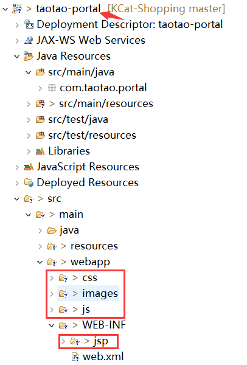

# 前后端分离      

本文主要介绍前台和后台分离的方式，各自搭建一个工程，可以减低耦合度，灵活地进行分布式部署。而由于是不同的工程，服务之间通过接口通信，开发工作量提高。    

这里使用两个项目来搭建前台，分别是服务层 & 表现层。   

## 1.创建后端工程(服务层)   

使用到的技术：Mybatis, Spring, SpringMVC

- 创建war工程
- 继承于parent工程

### 1.pom添加依赖   

直接依赖整个模块，把相关的jar包都继承过来。

1. dao层：

```xml
  <dependencies>
  	<dependency>
  		<groupId>com.taotao</groupId>
  		<artifactId>taotao-manager-mapper</artifactId>
  		<version>0.0.1-SNAPSHOT</version>
  	</dependency>
  </dependencies>
```

2. service层：依赖Spring    

```xml
  		<!-- Spring -->
	<dependency>
		<groupId>org.springframework</groupId>
		<artifactId>spring-context</artifactId>
		<version>${spring.version}</version>
	</dependency>
	<dependency>
		<groupId>org.springframework</groupId>
		<artifactId>spring-beans</artifactId>
		<version>${spring.version}</version>
	</dependency>
	<dependency>
		<groupId>org.springframework</groupId>
		<artifactId>spring-webmvc</artifactId>
		<version>${spring.version}</version>
	</dependency>
	<dependency>
		<groupId>org.springframework</groupId>
		<artifactId>spring-jdbc</artifactId>
		<version>${spring.version}</version>
	</dependency>
	<dependency>
		<groupId>org.springframework</groupId>
		<artifactId>spring-aspects</artifactId>
		<version>${spring.version}</version>
	</dependency>
```

3. controller层   

```xml
	<dependency>
		<groupId>javax.servlet</groupId>
		<artifactId>servlet-api</artifactId>
		<version>${servlet-api.version}</version>
		<scope>provided</scope>
	</dependency>
	<dependency>
		<groupId>javax.servlet</groupId>
		<artifactId>jsp-api</artifactId>
		<version>${jsp-api.version}</version>
		<scope>provided</scope>
	</dependency>
```

### 2.添加web.xml    

使用之前的web.xml修改springmvc拦截路径：只要是改路径下的都会被springmvc拦截    

```xml
	<servlet-mapping>
		<servlet-name>taotao-manager</servlet-name>
		<url-pattern>/rest/*</url-pattern>
	</servlet-mapping>
```

### 3.框架整合

添加resources 。

1. 在applicationContext中因为dao层使用同一个，所以还是扫描：``com.taotao.mapper`` 。

2. service扫描的是  ``com.taotao.rest.service`` 。      

3. 事务需要指向新的包：

   ```xml
   	<!-- 切面 -->
   	<aop:config>
   		<aop:advisor advice-ref="txAdvice"
   			pointcut="execution(* com.taotao.rest.service.*.*(..))" />
   	</aop:config>
   ```

4. springmvc扫描的包重新指向：

   ```xml
   	<context:component-scan base-package="com.taotao.rest.controller" />
   ```

   

### 4.配置tomcat

1. 使用不同的端口号：8081    

### 5.静态资源的位置

 

为了静态资源  

## 2.创建前端工程(表现层)

使用到的技术：Spring, SpringMVC, jstl, jQuery, httpClient    

客户端和服务端之间没有直接依赖关系，完全独立。

- 创建war工程
- 继承于parent工程

### 1.pom添加依赖

1. service层：依赖taotao-common，Spring  ，前端jar包  

```xml
  		<!-- Spring -->
	<dependency>
		<groupId>org.springframework</groupId>
		<artifactId>spring-context</artifactId>
		<version>${spring.version}</version>
	</dependency>
	<dependency>
		<groupId>org.springframework</groupId>
		<artifactId>spring-beans</artifactId>
		<version>${spring.version}</version>
	</dependency>
	<dependency>
		<groupId>org.springframework</groupId>
		<artifactId>spring-webmvc</artifactId>
		<version>${spring.version}</version>
	</dependency>
	<dependency>
		<groupId>org.springframework</groupId>
		<artifactId>spring-jdbc</artifactId>
		<version>${spring.version}</version>
	</dependency>
	<dependency>
		<groupId>org.springframework</groupId>
		<artifactId>spring-aspects</artifactId>
		<version>${spring.version}</version>
	</dependency>
	<!-- JSP相关 -->
	<dependency>
		<groupId>jstl</groupId>
		<artifactId>jstl</artifactId>
		<version>${jstl.version}</version>
	</dependency>
	<dependency>
		<groupId>javax.servlet</groupId>
		<artifactId>servlet-api</artifactId>
		<version>${servlet-api.version}</version>
		<scope>provided</scope>
	</dependency>
	<dependency>
		<groupId>javax.servlet</groupId>
		<artifactId>jsp-api</artifactId>
		<version>${jsp-api.version}</version>
		<scope>provided</scope>
	</dependency>
```

把common和所需的jar包依赖过来。

### 2.添加web.xml

修改前端控制器&过滤拦截：html伪静态化

```xml
	<servlet-mapping>
		<servlet-name>taotao-portal</servlet-name>
		<url-pattern>*.html</url-pattern>
	</servlet-mapping>
...
	<!-- springmvc的前端控制器 -->
	<servlet>
		<servlet-name>taotao-portal</servlet-name>
		<servlet-class>org.springframework.web.servlet.DispatcherServlet</servlet-class>
		<!-- contextConfigLocation不是必须的， 如果不配置contextConfigLocation， springmvc的配置文件默认在：WEB-INF/servlet的name+"-servlet.xml" -->
		<init-param>
			<param-name>contextConfigLocation</param-name>
			<param-value>classpath:spring/springmvc.xml</param-value>
		</init-param>
		<load-on-startup>1</load-on-startup>
	</servlet>
```

### 3.框架整合

添加resources 。

1. 不需要访问dao，不添加applicationContext-dao。

2. 修改applicationContext-service的配置文件

   ```xml
   	<!-- 加载配置文件 -->
   	<context:property-placeholder location="classpath:resource/*.properties" />
   	<!-- 扫描包加载Service实现类 -->
   	<context:component-scan base-package="com.taotao.portal.service"></context:component-scan>
   ```

3. 不需要事务，不添加trans。

4. springmvc扫描的包重新指向：资源上传和文件映射不需要

```xml
...
	<context:component-scan base-package="com.taotao.portal.controller" />
	<mvc:annotation-driven />
	<bean
		class="org.springframework.web.servlet.view.InternalResourceViewResolver">
		<property name="prefix" value="/WEB-INF/jsp/" />
		<property name="suffix" value=".jsp" />
	</bean>
...
```

   

### 4.配置tomcat

1. 使用不同的端口号，HTTP , AJP ，才能进行启动。   


### 5.跨域问题   

js不能进行跨域请求，js设计时为了安全考虑。域名相同，端口相同才不算跨域。

可以使用jsonp解决跨域问题。js跨域请求数据不行，js请求js脚本可以。   

将json数据变成js语句，然后追加到请求中。    

怎么提取后台的数据


先解决双tomcat问题，再解决跨域问题，用DZM


分层：  web工程   +   表现层


新建工程：taotao-reset    

属于服务层    

使用ssm发布服务

添加pom，添加项目的依赖

添加web.xml   ，伪静态化

添加配置文件，参考之前   

安装到本地仓库   

修改端口，启动执行新建的模块   

修改配置文件   

配置tomcat

添加jsp页面，其他资源

处理返回的编码问题，两种方式     


怎么处理多个tomcat启动   


5天03天10min


##  导航的制作   


feiman关注重要一个点：关注前后端分离，其他实现即可。学这个原因因为kcat用到

feiman老少     发布


