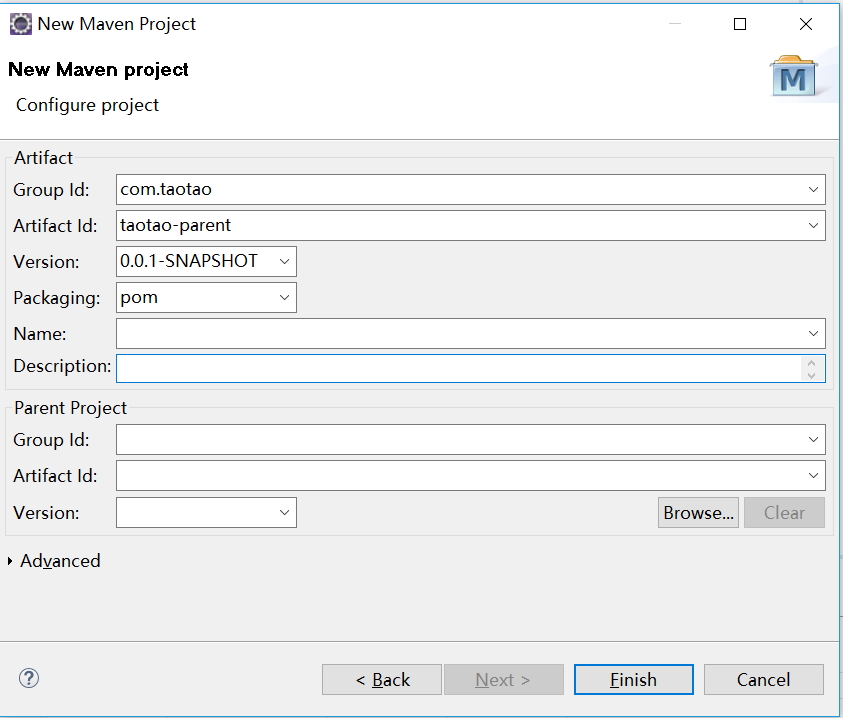

# maven工程搭建(feiman：why，no step)   

## 1.maven的仓库   

1. Maven在某个统一的位置存储所有项目的共享的构件（jar包），这个统一的位置，我们就称之为仓库。    
2. eclipse默认仓库位置：当前用户的.m2\repository文件夹下（例如：C:\Users\liyb\ .m2）   

只要把所需的jar包放在里面，maven就会根据pom.xml自动去找，如果本地仓库找不到，就回去远程仓库找。   

## 2.新建maven工程   

### 1.跳过模板的选择   

打勾  Create a simple project

### 2.新建项目解读   

  

- Group Id:组织id，同一个项目使用相同的groupId，一般为域名倒置  
- Artifact Id:打包jar/war后的名字    


- Packaging类型：
  - 父工程使用pom   
  - 被依赖的项目用jar  


## 3.pom.xml文件解析  

pom.xml文件用来配置版本信息，告诉程序需要去下载哪些jar包  

### 1.集中定义版本号   

在parent中集中定义管理版本号，但不实际依赖   

_像个规划的，只管是哪个版本的，还没去仓库拿插件_  

```xml
	<!-- 集中定义依赖版本号 -->
	<properties>
		<junit.version>4.12</junit.version>
		<spring.version>4.1.3.RELEASE</spring.version>
		<mybatis.version>3.2.8</mybatis.version>
		<mybatis.spring.version>1.2.2</mybatis.spring.version>
		<mybatis.paginator.version>1.2.15</mybatis.paginator.version>
		<mysql.version>5.1.32</mysql.version>
		<slf4j.version>1.6.4</slf4j.version>
		<jackson.version>2.4.2</jackson.version>
		<druid.version>1.0.9</druid.version>
		<httpclient.version>4.3.5</httpclient.version>
		<jstl.version>1.2</jstl.version>
		<servlet-api.version>2.5</servlet-api.version>
		<jsp-api.version>2.0</jsp-api.version>
		<joda-time.version>2.5</joda-time.version>
		<commons-lang3.version>3.3.2</commons-lang3.version>
		<commons-io.version>1.3.2</commons-io.version>
		<commons-net.version>3.3</commons-net.version>
		<pagehelper.version>3.4.2-fix</pagehelper.version>
		<jsqlparser.version>0.9.1</jsqlparser.version>
		<commons-fileupload.version>1.3.1</commons-fileupload.version>
		<jedis.version>2.7.2</jedis.version>
		<solrj.version>4.10.3</solrj.version>
	</properties>
```

```xml 
	<dependencyManagement>
		<dependencies>
			<!-- 时间操作组件 -->
			<dependency>
				<groupId>joda-time</groupId>
				<artifactId>joda-time</artifactId>
				<version>${joda-time.version}</version>
			</dependency>
			<!-- Apache工具组件 -->
			<dependency>
				<groupId>org.apache.commons</groupId>
				<artifactId>commons-lang3</artifactId>
				<version>${commons-lang3.version}</version>
			</dependency>
			<dependency>
				<groupId>org.apache.commons</groupId>
				<artifactId>commons-io</artifactId>
				<version>${commons-io.version}</version>
			</dependency>
			<dependency>
				<groupId>commons-net</groupId>
				<artifactId>commons-net</artifactId>
				<version>${commons-net.version}</version>
			</dependency>
			<!-- Jackson Json处理工具包 -->
			<dependency>
				<groupId>com.fasterxml.jackson.core</groupId>
				<artifactId>jackson-databind</artifactId>
				<version>${jackson.version}</version>
			</dependency>
			<!-- httpclient -->
			<dependency>
				<groupId>org.apache.httpcomponents</groupId>
				<artifactId>httpclient</artifactId>
				<version>${httpclient.version}</version>
			</dependency>
			<!-- 单元测试 -->
			<dependency>
				<groupId>junit</groupId>
				<artifactId>junit</artifactId>
				<version>${junit.version}</version>
				<scope>test</scope>
			</dependency>
			<!-- 日志处理 -->
			<dependency>
				<groupId>org.slf4j</groupId>
				<artifactId>slf4j-log4j12</artifactId>
				<version>${slf4j.version}</version>
			</dependency>
			<!-- Mybatis -->
			<dependency>
				<groupId>org.mybatis</groupId>
				<artifactId>mybatis</artifactId>
				<version>${mybatis.version}</version>
			</dependency>
			<dependency>
				<groupId>org.mybatis</groupId>
				<artifactId>mybatis-spring</artifactId>
				<version>${mybatis.spring.version}</version>
			</dependency>
			<dependency>
				<groupId>com.github.miemiedev</groupId>
				<artifactId>mybatis-paginator</artifactId>
				<version>${mybatis.paginator.version}</version>
			</dependency>
			<dependency>
				<groupId>com.github.pagehelper</groupId>
				<artifactId>pagehelper</artifactId>
				<version>${pagehelper.version}</version>
			</dependency>
			<!-- MySql -->
			<dependency>
				<groupId>mysql</groupId>
				<artifactId>mysql-connector-java</artifactId>
				<version>${mysql.version}</version>
			</dependency>
			<!-- 连接池 -->
			<dependency>
				<groupId>com.alibaba</groupId>
				<artifactId>druid</artifactId>
				<version>${druid.version}</version>
			</dependency>
			<!-- Spring -->
			<dependency>
				<groupId>org.springframework</groupId>
				<artifactId>spring-context</artifactId>
				<version>${spring.version}</version>
			</dependency>
			<dependency>
				<groupId>org.springframework</groupId>
				<artifactId>spring-beans</artifactId>
				<version>${spring.version}</version>
			</dependency>
			<dependency>
				<groupId>org.springframework</groupId>
				<artifactId>spring-webmvc</artifactId>
				<version>${spring.version}</version>
			</dependency>
			<dependency>
				<groupId>org.springframework</groupId>
				<artifactId>spring-jdbc</artifactId>
				<version>${spring.version}</version>
			</dependency>
			<dependency>
				<groupId>org.springframework</groupId>
				<artifactId>spring-aspects</artifactId>
				<version>${spring.version}</version>
			</dependency>
			<!-- JSP相关 -->
			<dependency>
				<groupId>jstl</groupId>
				<artifactId>jstl</artifactId>
				<version>${jstl.version}</version>
			</dependency>
			<dependency>
				<groupId>javax.servlet</groupId>
				<artifactId>servlet-api</artifactId>
				<version>${servlet-api.version}</version>
				<scope>provided</scope>
			</dependency>
			<dependency>
				<groupId>javax.servlet</groupId>
				<artifactId>jsp-api</artifactId>
				<version>${jsp-api.version}</version>
				<scope>provided</scope>
			</dependency>
			<!-- 文件上传组件 -->
			<dependency>
				<groupId>commons-fileupload</groupId>
				<artifactId>commons-fileupload</artifactId>
				<version>${commons-fileupload.version}</version>
			</dependency>
			<!-- Redis客户端 -->
			<dependency>
				<groupId>redis.clients</groupId>
				<artifactId>jedis</artifactId>
				<version>${jedis.version}</version>
			</dependency>
			<!-- solr客户端 -->
			<dependency>
				<groupId>org.apache.solr</groupId>
				<artifactId>solr-solrj</artifactId>
				<version>${solrj.version}</version>
			</dependency>
		</dependencies>
	</dependencyManagement>
```

组件名称（Group Id，Artifact Id，同2-2），${XX.version}引用上方的版本号    

依赖父工程的pom.xml文件不需要再定义版本：``<version>${solrj.version}</version>``   

### 2.添加实际依赖   

```xml
	<build>
		<finalName>${project.artifactId}</finalName>
		<plugins>
			<!-- 资源文件拷贝插件 -->
			<plugin>
				<groupId>org.apache.maven.plugins</groupId>
				<artifactId>maven-resources-plugin</artifactId>
				<version>2.7</version>
				<configuration>
					<encoding>UTF-8</encoding>
				</configuration>
			</plugin>
			<!-- java编译插件 -->
			<plugin>
				<groupId>org.apache.maven.plugins</groupId>
				<artifactId>maven-compiler-plugin</artifactId>
				<version>3.2</version>
				<configuration>
					<source>1.7</source>
					<target>1.7</target>
					<encoding>UTF-8</encoding>
				</configuration>
			</plugin>
		</plugins>
		<pluginManagement>
			<plugins>
				<!-- 配置Tomcat插件 -->
				<plugin>
					<groupId>org.apache.tomcat.maven</groupId>
					<artifactId>tomcat7-maven-plugin</artifactId>
					<version>2.2</version>
				</plugin>
			</plugins>
		</pluginManagement>
	</build>
```

- 编译插件可以解决部署项目的时候默认1.5jdk问题   
- tomcat插件使得调试更为方便       

### 3.自动生成的信息  

本身工程

```xml
	<groupId>com.taotao</groupId>
	<artifactId>taotao-common</artifactId>
	<version>0.0.1-SNAPSHOT</version>
```

依赖的父工程

```xml
	<parent>
		<groupId>com.taotao</groupId>
		<artifactId>taotao-parent</artifactId>
		<version>0.0.1-SNAPSHOT</version>
	</parent>
```


## 4.maven项目的分工   

### 1.taotao-parent  

所有项目的父工程，pom.xml定义了要用的所有插件的版本

### 2.taotao-common   

通用的工具存放的地方，通过继承taotao.parent获取其管理的版本，并对插件进行实际依赖   

为了让其他包依赖，打成jar包。

Artifact Id为taotao-commom  

    

  

