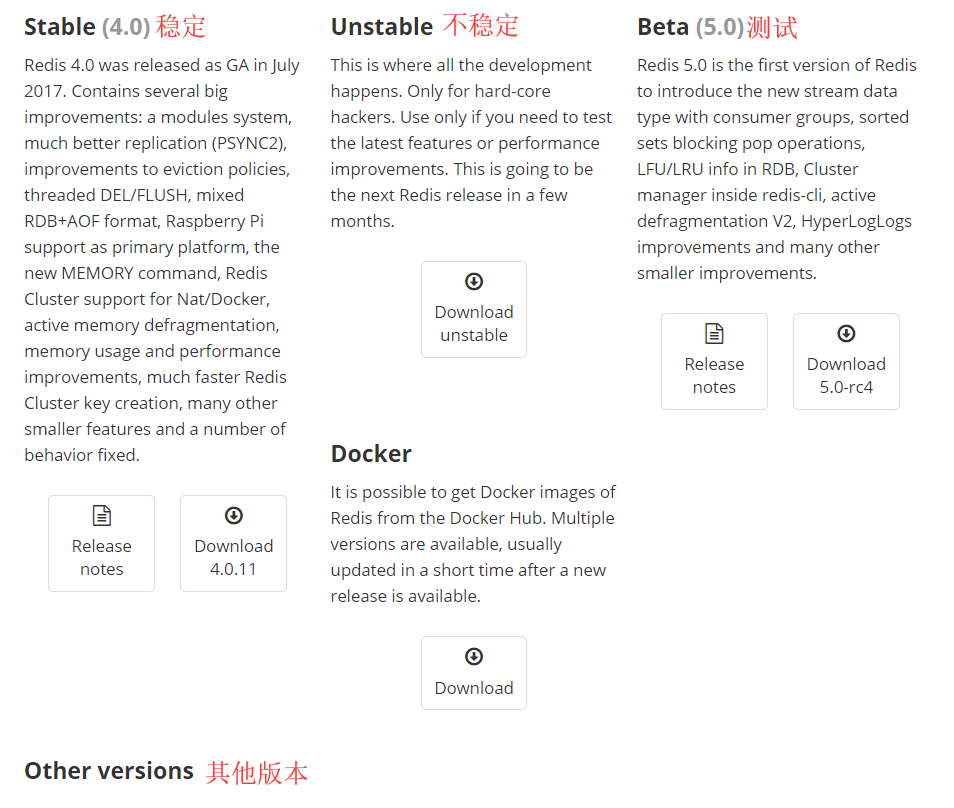

# redis   

M:安装redis需要什么前提条件？

Z:先安装gcc，安装命令：``yum install gcc c++``    ，安装redis。

M:怎么安装redis到服务器？

Z:1.下载redis的地址``https://redis.io/download``   

    

2.将redis上传到linux上，解压，进入解压后的目录。

``make``执行编译，``make install PREFIX=/usr/local/redis``指定安装的目录进行安装。   

M:为什么我安装提示文件夹创建失败？

Z:那是你没有是用user账号进行安装吧。

M:安装好之后怎么启动redis呢？

Z:进入安装的目录``/usr/local/redis/bin``,进入之后可以使用两种启动模式：

 1.  前端启动

     直接``./redis-server``,端口是6379      

 2.  后端启动

     先复制源码包的``redis.conf``配置文件到redis的安装目录``cp redis.conf /usr/local/redis/bin/``

     修改配置文件

     ``daemonize yes``改成 yes  

     指定配置文件启动redis``./redis-server redis.conf``   

M:启动之后没什么反应，怎么知道有没有启动呢？

Z:查看redis进程``ps aux|grep redis``  

M:那我要执行redis命令呢？

Z:指定cli进入redis命令模式``./redis-cli``   

	常用命令：``ping`` ， ``set a 10``  , ``get a``  , 增1``incr a``, 减1``decr a``,  删除a ``del a``  ,列出所有 ``keys *``   

	常用数据类型：``String``, ``Hash`` , ``List``, ``Set``, ``SortedSet``    

M:单机版的redis搭建好了，那集群的redis要怎么搭建呢？

Z:我来演示下怎么搭建6个redis实例集群，首先规定一下端口号：7001 ~ 7006  

1. 进入``usr/local``目录，创建redis-cluster目录``mkdir redis-cluster``   

2. 复制redis/bin文件到/redis-cluster下，改为redis01  ``cp -r bin ../redis-cluster/redis01``   

3. 删除dump.rdb``rm -f dump.rdb``  ,rdb就是将内存的状态直接保存的快照文件

4. 复制多个redis0n文件，n从1~6``cp -r redis01/ redis06``   

5. 复制之后修改每个redis0n里的redis.conf文件``vim redis.conf ``   

   修改对应端口号

   ```
   port 7001
   ```

   如果配置yes则开启集群功能

   ```
   cluster-enabled yes
   ```

6. 复制创建集群的ruby脚本redis-trib.rb（在redis源码的src文件夹下）到redis-cluster文件夹下``cp *.rb /usr/local/redis-cluster/``   

7. 启动实例：创建脚本startall.sh``vim startall.sh``，对6个redis一并进行启动

   ```
   cd redis01
   ./redis-server redis.conf
   cd ..
   cd redis02
   ./redis-server redis.conf
   cd ..
   cd redis03
   ./redis-server redis.conf
   cd ..
   cd redis04
   ./redis-server redis.conf
   cd ..
   cd redis05
   ./redis-server redis.conf
   cd ..
   cd redis06
   ./redis-server redis.conf
   cd ..
   ```

   文件添加执行权利``chmod +x startall.sh``，+x前面可以指定u 代表用户. g 代表用户组. o 代表其他. a 代表所有. 。 没有添加则默认为a

   执行脚本``./startall.sh``,查看进程即可验证是否执行成功。 

8. 执行创建集群命令：对创建集群的ruby脚本告诉它ip

   ```
   ./redis-trib.rb create --replicas 1 192.168.0.105:7001 192.168.0.105:7002 192.168.0.105:7003 192.168.0.105:7004 192.168.0.105:7005 192.168.0.105:7006
   ```

M:但是为什么linux执行脚本要添加``./``不可呢？

Z:执行unix或linux中除了path系统变量外的目录下的命令都要加``./``。

M:为什么ruby语言用不了？

Z:要使用ruby脚本，就得安装ruby的环境。     

```
yum install ruby
yum install rubygems
```

还需要redis和ruby的接口，gem命令安装redis-3.0.0.gem

```
gem install /home/ftpuser/Desktop/redis-3.0.0.gem
```

M:为什么我刚刚连接不上服务了？

Z:首先你要看看ip地址是不是变了，而且如果你重启过服务器，redis进程是需要重开的。

M:那我集群搭建好了，要怎么做测试呢？

Z:连接任意一个结点，运行测试代码``set a 100``

```
redis01/redis-cli -h 192.168.0.105 -p 7002 -c
```

M:为什么进去redis01，连的确实7002的结点

Z:它redis01用的是他的redis-cli客户端，连接结点随便哪一个都可以。

M:那我redis想关闭的时候怎么办呢？

Z:如果没有正常关闭redis，存在内存的数据可能会丢失，关闭命令``bin/redis-cli -p 7001 shutdown``,这里我把它写成一个脚本

```
redis01/redis-cli -p 7001 shutdown
redis02/redis-cli -p 7002 shutdown
redis03/redis-cli -p 7003 shutdown
redis04/redis-cli -p 7004 shutdown
redis05/redis-cli -p 7005 shutdown
redis06/redis-cli -p 7006 shutdown
```

M:那redis在java中怎么使用呢？

Z:用jedis，jedis是集成了redis的一些命令操作，封装了redis的java客户端。提供了连接池管理。

使用案例：

1. pom中引入jar包   

   ```xml
   			<dependency>
   				<groupId>redis.clients</groupId>
   				<artifactId>jedis</artifactId>
   				<version>2.7.2</version>
   			</dependency>
   ```

2. 编写测试代码

   ```java
   	@Test
   	public void testJedisPool(){
   		//创建jedis连接池
   		JedisPool pool = new JedisPool("192.168.0.105",6379);
   		//从连接池获取jedis对象
   		Jedis jedis = pool.getResource();
   		jedis.set("key2", "hello jedis hehe");
   		String string = jedis.get("key1");
   		System.out.println(string);
   		//关闭jedis对象
   		jedis.close();
   		pool.close();
   	}
   ```

   可以对redis的数据库写入读取键值对。

M:为什么我执行的时候获取不到jedis对象呢？

Z:可能是linux防火墙的问题，CentOS6防火墙相关命令：

```
关闭 /开启/重启防火墙
service iptables stop 
service iptables start 
service iptables restart  
永久关闭防火墙
/sbin/service iptables stop
chkconfig iptables off
```

M:单机版的jedis知道怎么操作，那集群的呢？

Z:添加所有的结点，添加数据到数组就可以，连redis都自动分配。

```java
	@Test
	public void testJedisCluster(){
		HashSet<HostAndPort> nodes = new HashSet<>();
		nodes.add(new HostAndPort("192.168.0.105", 7001));
		nodes.add(new HostAndPort("192.168.0.105", 7002));
		nodes.add(new HostAndPort("192.168.0.105", 7003));
		nodes.add(new HostAndPort("192.168.0.105", 7004));
		nodes.add(new HostAndPort("192.168.0.105", 7005));
		nodes.add(new HostAndPort("192.168.0.105", 7006));
		JedisCluster cluster = new JedisCluster(nodes);
		cluster.set("key3", "888");
		String string = cluster.get("key3");
		System.out.println(string);
		cluster.close();
	}
```

M:那我实际使用中怎么调用jedis呢，难道每一次都要配置host和port？

Z:当然不是这样，因为jedis被多次调用到，所以我们这里可以使用spring容器对redis进行管理，然后通过注解的方式提供jedis对象。

简单来说就是将host和port的配置写在spring配置文件ApplicationContext-jedis.xml中

【单机版】

```xml
	<!-- jedis客户端单机版 -->
	<bean id="redisClient" class="redis.clients.jedis.JedisPool">
		<constructor-arg name="host" value="192.168.0.107"></constructor-arg>
		<constructor-arg name="port" value="6379"></constructor-arg>
	</bean>
```

【集群版】

```xml
	<bean id="redisClient" class="redis.clients.jedis.JedisCluster">
		<constructor-arg name="nodes">
			<set>
				<bean class="redis.clients.jedis.HostAndPort.HostAndPort">
					<constructor-arg name="host" value="192.168.0.107"></constructor-arg>
					<constructor-arg name="port" value="7001"></constructor-arg>
				</bean>
				<bean class="redis.clients.jedis.HostAndPort.HostAndPort">
					<constructor-arg name="host" value="192.168.0.107"></constructor-arg>
					<constructor-arg name="port" value="7002"></constructor-arg>
				</bean>
...
			</set>		
		</constructor-arg>
	</bean>
```

M:这个配置的id、class是什么意思呢？

Z:id是被实例化的bean，而class是要被Spring实例化的类。

M:那我要怎么测试配置是否成功呢？

Z:单个redis测试

```java
	@Test
	public void testSingle(){
		ApplicationContext applicationContext = new ClassPathXmlApplicationContext("classpath:spring/applicationContext-*.xml");
		JedisPool pool = (JedisPool) applicationContext.getBean("redisClient");
		Jedis jedis = pool.getResource();
		String str = jedis.get("key1");
		System.out.println(str);
		jedis.close();
		pool.close();
	}
```

通过Spring实例化JedisPool，获取redis的内容

M:那为什么我测试集群版的会失败呢？

```java
	/**
	 * spring & redis
	 * 集群测试redis
	 */
	@Test
	public void testCluster(){
		ApplicationContext applicationContext = new ClassPathXmlApplicationContext("classpath:spring/applicationContext-*.xml");
		JedisCluster jedisCluster = (JedisCluster) applicationContext.getBean("redisClient");
		String str = jedisCluster.get("key1");
		System.out.println(str);
		jedisCluster.close();
	}
```

Z:可能还是网卡的问题，如果你查询网卡发现ip地址是空的，可以修改CentOS的网络配置文件

1. ``vim /etc/sysconfig/network-scripts/ifcfg-eth0``编辑网络配置    

2. 修改BOOTPROTO的值“dhcp”为“none”，表示静态ip

   ``BOOTPROTO="none"``

3. 添加ip配置  

   ```xml
   IPADDR=192.168.1.1      --ip地址
   NETMASK=255.255.255.0  --子网掩码
   GATEWAY=192.168.0.1   --设置网关 必须和IP地址同一网段
   ```

4. 重启网络   ``/etc/init.d/network reload``   

M:但是我这样配了之后还是不行啊！

Z:注意下面两点

1. 缓存删了没有

```
cd redis01
rm dump.rdb
rm nodes.conf

cd ..
cd redis02
rm dump.rdb
rm nodes.conf
...
```

2. 因为修改了ip，所以需要重新执行创建集群命令：对创建集群的ruby脚本告诉它ip。

这样子做之后，他就能通过spring访问到redis数据了。    

M:开发的时候用单机版，而实际使用的时候用集群版，但是两者之间代码有区别，怎么同时适配两种情况呢？

Z:那就得利用配置文件进行控制了。首先将两种情况都列出来，使用接口的方式来规范类的实现。

```java
public interface JedisClient {
	
	String get(String key);
	String set(String key, String value);
	String hget(String hkey, String key);
	long hset(String hkey, String key, String value);
	long incr(String key);
	long expire(String key, int second);
	long ttl(String key);
	
}
```

```java
//不添加注解，手动在配置文件配
public class JedisClientCluster implements JedisClient {
	
	@Autowired
	private JedisCluster jedisCluster;
	
	@Override
	public String get(String key) {
		return jedisCluster.get(key);
	}
    ...
```

```java
//不添加注解，在配置文件配
public class JedisClientSingle implements JedisClient {
	
	@Autowired
	private JedisPool jedisPool;
	
	@Override
	public String get(String key) {
		Jedis jedis = jedisPool.getResource();
		String str = jedis.get(key);
		jedis.close();
		return str;
	}

	@Override
	public String set(String key, String value) {
		Jedis jedis = jedisPool.getResource();
		String str = jedis.set(key, value);
		jedis.close();
		return str;
	}
    ...
```

但是接口写了之后，可不能直接在类上面添加注解，因为要用哪个还不一定呢。所以注解要改用配置文件的方式，在 applicationContext-jedis.xml 配置文件中规定使用哪个类。

```xml
	<!-- 单机版 -->
	<bean id="JedisClient" class="com.taotao.rest.dao.impl.JedisClientSingle"></bean>
```

```xml
	<!-- 集群版 -->
	<bean id="JedisClientCluster" class="com.taotao.rest.dao.impl.JedisClientCluster"></bean>
```

这个配置中，就可以指定对象进行注入。

M:那怎么将对象进行注入呢？

Z:使用``@Autowired``注解就可以了。

```java
	@Autowired
	private JedisClient jedisClient;
```

M:那我已经有jedisClient对象了，要怎么使用redis缓存呢？

Z:添加无影响的缓存提取存储操作。

```java
	@Value("${INDEX_CONTENT_REDIS_KEY}")
	private String INDEX_CONTENT_REDIS_KEY;
	
	@Override
	public List<TbContent> getContentList(long contentCid) {
		
		//从缓存中获取内容
		try {
			String result = jedisClient.hget(INDEX_CONTENT_REDIS_KEY, contentCid + "");
			if(!StringUtils.isEmpty(result)){
				List<TbContent> resultList = JsonUtils.jsonToList(result, TbContent.class);
				return resultList;
			}
		} catch (Exception e) {
			e.printStackTrace();
		}
		
		//根据内容分类id查询内容列表
		TbContentExample example = new TbContentExample();
		Criteria criteria = example.createCriteria();
		criteria.andCategoryIdEqualTo(contentCid);
		//执行查询
		List<TbContent> list =contentMapper.selectByExample(example);
		
		//向缓存中添加内容
		try {
			//redis存字符串，把list转化为字符串
			String cacheString = JsonUtils.objectToJson(list);
			jedisClient.hset(INDEX_CONTENT_REDIS_KEY, contentCid + "", cacheString);
		} catch (Exception e) {
			e.printStackTrace();
		}
		return list;
	}
```

D:为什么叫做无影响？

Z:因为添加try...catch...之后，就算redis报错，也不会导致程序停止运行。

D:这个注解是获取配置文件的值的，但是它是怎么做到的呢？``@Value("${INDEX_CONTENT_REDIS_KEY}")``   

Z:在``applicationContext-dao.xml``中可以配置加载配置文件

```xml
	<!-- 加载配置文件 -->
	<context:property-placeholder location="classpath:resource/*.properties" />
```

这样他就会读取道resource下``resource.properties``的内容

```xml
#首页信息在redis中保存的key
INDEX_CONTENT_REDIS_KEY=INDEX_CONTENT_REDIS_KEY 
```

M:但是为什么要在键值对的基础上，还添加这个值呢？

```java
String result = jedisClient.hget(INDEX_CONTENT_REDIS_KEY, contentCid + "");
```

Z:目前能想到的就是 分组 的功能，存入组名再存入编号，便于管理。

M:那这句的作用是怎么实现的，将字符串转化为List``List<TbContent> resultList = JsonUtils.jsonToList(result, TbContent.class);``  

Z:因为数据在存储的时候，就是通过List转化成字符串，这只不过是一个逆过程而已，至于怎么实现的：

```java 
    /**
     * 将json数据转换成pojo对象list
     * <p>Title: jsonToList</p>
     * <p>Description: </p>
     * @param jsonData
     * @param beanType
     * @return
     */
    public static <T>List<T> jsonToList(String jsonData, Class<T> beanType) {
    	JavaType javaType = MAPPER.getTypeFactory().constructParametricType(List.class, beanType);
    	try {
    		List<T> list = MAPPER.readValue(jsonData, javaType);
    		return list;
		} catch (Exception e) {
			e.printStackTrace();
		}
    	
    	return null;
    }
```

主要还是根据原本对象，使用jackson将数据在 对象 和 字符串 两种形态中相互转化。

M:为什么在hset存入redis的时候，要将List转化为String呢？

Z:因为redis的存储方式String字符串，所以需要对存储的数据进行处理。

M:但是现在有个问题，如果我数据修改了呢，redis还是存储旧的数据怎么办？

Z:那就把旧的redis删除，让它重新加载就可以了,在rest工程的Controller添加：

```java
	@RequestMapping("/content/{contentCid}")
	@ResponseBody
	public TaotaoResult contentCacheSync(@PathVariable Long contentCid){
		TaotaoResult result = redisService.syncContent(contentCid);
		return result;
	}
```

M:为什么之前的redis缓存添加是在Service层，而现在的删除却在Controller层。

Z:主要是使用的情况不同，rest工程是一个对前端数据进行交互的工程。所以做查询的时候，在Service就可以对数据进行缓存操作。

而涉及到存储的话，是通过manager工程（cms管理系统）将数据存入数据库中，所以它只能将删除缓存的操作放在Controller，供其他工程使用doGet调用。

M:其他工程是怎么通过doGet调用该Controller方法的呢？

Z:用HttpClientUtil工具类，直接将指定的redis信息删除掉。

```java
	@Override
	public TaotaoResult insertContent(TbContent content) {
		//补全pojo
		content.setCreated(new Date());
		content.setUpdated(new Date());
		contentMapper.insert(content);
		
		//添加缓存同步逻辑
		try{
			HttpClientUtil.doGet(REST_BASE_URL + REST_CONTENT_SYNC_URL + content.getCategoryId());
		}catch(Exception e){
			e.printStackTrace();
		}

		return TaotaoResult.ok();
	}
```