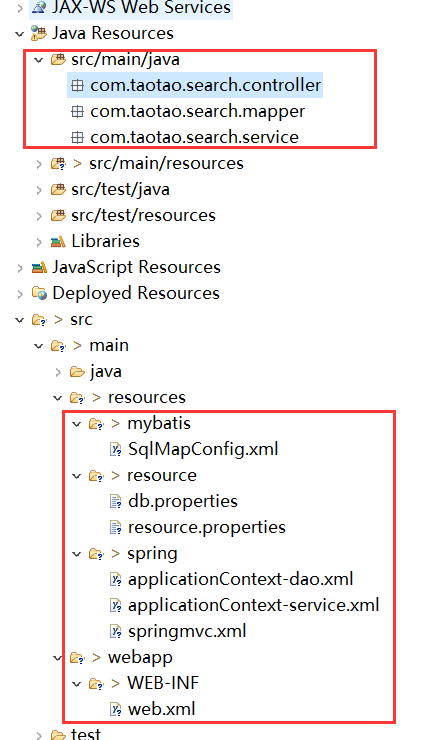

# solr的简单使用

M:solr是干嘛用的呢？

D:Solr是一个独立的企业级搜应用服务器，它对外提供类似于Web-service的API接口。用户可以通过http请求，向搜索引擎服务器提交一定格式的XML文件，生成索引；也可以通过Http Get操作提出查找请求，并得到XML格式的返回结果。solr将非结构化数据，通过分词、词法分析、过滤停词、语义分析等手段来转成结构化数据，存储为索引。

Z：就是说，solr是一种全网搜索，但是其还支持语义相同的关键词。（例如：搜索solr，却可以查询出来lucene内容）  

M:那安装solr服务器需要配置什么环境呢？

Z:jdk、tomcat  、IK Analyzer。

M:jdk怎么安装配置呢？

Z:1. 首先下载jdk安装包``jdk-7u55-linux-i586.tar.gz``。

2. 然后解压到指定的文件夹下``tar -zxvf jdk-7u55-linux-i586.tar.gz -C /usr/lib/jvm``

3. 配置环境变量``vim /etc/sysconfig/network-scripts/ifcfg-eth0``   

   ```properties
   export JAVA_HOME=/usr/lib/jvm/jdk1.7.0_55
   export JRE_HOME=${JAVA_HOME}/jre
   export CLASSPATH=.:${JAVA_HOME}/lib:${JRE_HOME}/lib
   export PATH=${JAVA_HOME}/bin:$PATH
   ```

4. 执行profile``source /etc/profile``即可检查jdk``java -version``是否安装成功了。   

M:tomcat安装在哪里呢？

Z:``/usr/local/solr/tomcat``  

M:那命令为：``tar -zxvf apache-tomcat-7.0.47.tar.gz -C /usr/local/solr/tomcat`` ,如果没有文件夹需要创建指定文件夹。

M:那现在可以安装solr了吧，solr安装到哪里呢？

Z:这个安装的方式可有点不同，具体操作是把``/dist/solr-4.10.3.war``复制到tomcat的webapps下，运行tomcat进行自动解压。（运行bin下的startup.sh） 

M:为什么我启动的时候报错：``tomcat Neither the JAVA_HOME nor the JRE_HOME environment variable is defined``  

Z:因为你使用的jdk不是通过yum安装的，而是下载拉进去的，虽然也配置了java_home，但tomcat不太智能，仍然没有自动识别出java_home路径。所以需要编辑文件，tomcat下的catalina.sh``tomcat/bin/catalina.sh``，添加以下两行代码在开头处：

```properties
# -----------------------------------------------------------------------------
export JAVA_HOME=/usr/lib/jvm/jdk1.7.0_55
export JRE_HOME=/usr/lib/jvm/jdk1.7.0_55/jre
```

M:如果要看tomcat的启动情况怎么做？

Z:可以用``tail -f logs/catalina.out``查看日志。  

M:那tomcat要怎么关闭呢？

Z: 执行bin下的shutdown.sh，顺便说一下，war包的删除需要关闭tomcat。

M:除了war包，还需要别的什么吗？

Z:还有 jar包  &  配置文件

1. 把``solr-4.10.3/example/lib/ext``下的jar包复制到webapps的``/webapps/solr-4.10.3/WEB-INF/lib``中。
2. 拷贝log4j.properties文件，在Tomcat下webapps\solr\WEB-INF目录中创建文件 classes文件夹，复制Solr目录下``example\resources\log4j.properties``至Tomcat下``webapps\solr\WEB-INF\classes``目录。 
2. 把``solr-4.10.3/example/``下的solr拷贝到``/usr/local/solr/solrhome``与tomcat同级的目录下:``cp -r solr /usr/local/solr``(文件夹需要添加-r)

M:但是solr工程怎么知道自己的配置文件在哪里呢？

Z:所以需要修改solr工程的web.xml文件，配置JNDI，指向配置文件的目录

```xml
    <env-entry>
       <env-entry-name>solr/home</env-entry-name>
       <env-entry-value>/usr/local/solr/solrhome</env-entry-value>
       <env-entry-type>java.lang.String</env-entry-type>
    </env-entry>
```

M:完成之后怎么测试呢？

Z:linux中启动tomcat，然后进行访问8080/solr看看有没有solr页面，有则搭建成功了。

M:但是为什么我现在显示当前机子无法访问目标主机呢？

Z:你可以尝试使用Nat自动获取ip的方式，如果这样可以ping得通的话，就可以启动后进行访问了（记得修改解压文件夹名为solr）。

M：安装完solr之后要怎么使用呢？

Z：需要先配置中文分析器，再配置业务字段。

M：什么是中文分析器？

Z：中文分词器 IK Analyzer 。例如输入 ``基于java语言开发的轻量级的中文分词工具包``,可以自动切割为``基于|java|语言|开发|的|轻量级|的|中文|分词|工具包|``。    

M：IK Analyzer怎么安装呢？

Z：安装IK Analyzer步骤如下

1. 需要把IK Analyzer 的jar包``IKAnalyzer2012FF_u1.jar`` 添加到solr工程的lib文件夹下。   

2. 拷贝IK Analyzer 的配置文件``IKAnalyzer.cfg.xml``,相关字典``ext_stopword.dic,mydict.dic``到WEB-INF的classes文件夹下，如果没有该文件夹，新建一个。   

3. 配置文件配置fieldType，位置在``/solrhome/collection1/conf/schema.xml``   

   ```xml
   <fieldType name="text_ik" class="solr.TextField">
     <analyzer class="org.wltea.analyzer.lucene.IKAnalyzer"/>
   </fieldType>
   ```

M：那业务字段要怎么配置呢？

Z：首先要确定配置哪些字段。

M：那要怎么判断这字段需不需要配置呢？

Z：判断标准   1.搜索时是否需要该字段	2.后序业务用到不

需要用到字段如下

```
商品id
商品title
卖点
价格
商品图片
商品分类名称
商品描述
```

M：添加在哪里呢？

Z：之前的``schema.xml``文件中

```xml
<field name="item_title" type="text_ik" indexed="true" stored="true"/>
<field name="item_sell_point" type="text_ik" indexed="true" stored="true"/>
<field name="item_price"  type="long" indexed="true" stored="true"/>
<field name="item_image" type="string" indexed="false" stored="true" />
<field name="item_category_name" type="string" indexed="true" stored="true" />
<field name="item_desc" type="text_ik" indexed="true" stored="false" />

<field name="item_keywords" type="text_ik" indexed="true" stored="false" multiValued="true"/>
<copyField source="item_title" dest="item_keywords"/>
<copyField source="item_sell_point" dest="item_keywords"/>
<copyField source="item_category_name" dest="item_keywords"/>
<copyField source="item_desc" dest="item_keywords"/>
```

M：name对应的是id，stored是什么意思？

Z：stored为true的时候表示存储，存储不存储根据是否搜索该信息决定，desc描述只用于展示，所以不需要存储。   

M：下面的``copyField``是什么，有什么作用？

Z：复制域，是一种优化方式。把其他域复制到一块域上，更便于搜索。

M：那怎么测试业务字段是否配置成功呢？

Z：选择colletion1，如果FieldType下拉框中有添加的业务字段，并且对中文成功分割，则说明IK Analyzer中文分析器已配置成功。   

   

M：怎么进行索引库的添加、删除、修改 ？

Z：solr命令

   	1. 删除 ：``<delete><id>001</id></delete>`` ,``<delete><query>*:*</query></delete>``  删除之后需要进行提交 ``<commit/>`` 
   	2. 查询：``<query>*:*</query>``       


M：为什么没有修改呢？

Z：修改就是重新添加一次，只要id一样，内容就会被更新。

M：那要怎么将数据存进索引库中呢？不会是一条一条写进去吧。

Z：可以通过写java代码实现数据的导入。

M：那用到什么东西呢？

Z：需要用到solrJ客户端，所以要在maven工程中添加依赖。(parent统一管理中能找到)

```xml
	<!-- solr客户端 -->
	<dependency>
		<groupId>org.apache.solr</groupId>
		<artifactId>solr-solrj</artifactId>
	</dependency>
```

M：solrJ怎么做数据导入呢？

Z：使用solrServer对象提交solr文档对象

```java
	@Test
	public void addDocument() throws SolrServerException, IOException {
		//创建连接
		SolrServer solrServer = new HttpSolrServer("http://192.168.175.129:8080/solr");
		//创建文档对象
		SolrInputDocument document = new SolrInputDocument();
		document.addField("id", "test001");
		document.addField("item_title", "测试商品1");
		document.addField("item_price", 12345);
		//文档对象写入索引库
		solrServer.add(document);
		//提交
		solrServer.commit();
	}
```

M：那要怎么知道自己的索引是否导入成功呢？

Z：只要打开solr界面进行查询就可以了。

M：那删除的方法呢？

Z：删除有多种操作方式，可以通过id，id List，甚至query语句

```java
	@Test
	public void deleteDocument() throws SolrServerException, IOException{
		//创建连接
		SolrServer solrServer = new HttpSolrServer("http://192.168.175.129:8080/solr");
//		solrServer.deleteById("001");   //通过id删除
		solrServer.deleteByQuery("*:*");  //通过语句删除
		solrServer.commit();  
	}
```

M：大量的数据信息导入，要怎么做数据库跟索引库的对接呢？

Z：就是一个从数据库取出来，存到索引库的过程

```java
	@Override
	public TaotaoResult importAllItems(){
		try {
			//查询商品列表
			List<Item> list = itemMapper.getItemList();
			//商品信息写入索引库
			for (Item item:list) {
				//创建文档对象
				SolrInputDocument document = new SolrInputDocument();
				document.addField("id", item.getId());
				document.addField("item_title", item.getTitle());
				document.addField("item_sell_point", item.getSell_point());
				document.addField("item_price", item.getPrice());
				document.addField("item_image", item.getImage());
				document.addField("item_category_name", item.getCategory_name());
				document.addField("item_desc", item.getItem_des());
//			//创建连接
//			SolrServer solrServer = new HttpSolrServer("http://192.168.175.129:8080/solr");
				solrServer.add(document);
			}
			solrServer.commit();
		} catch (Exception e) {
			e.printStackTrace();
			return TaotaoResult.build(500, ExceptionUtil.getStackTrace(e));
		}
		return TaotaoResult.ok();
	}
```

- pojo对象

  ```java
  	private String id;
  	private String title;
  	private String sell_point;
  	private long price;
  	private String image;
  	private String category_name;
  	private String item_des;
  ```

- mapper层

  ```java
  public interface ItemMapper {
  	List<Item> getItemList();
  }
  ```

  ```xml
  <?xml version="1.0" encoding="UTF-8"?>
  <!DOCTYPE mapper PUBLIC "-//mybatis.org//DTD Mapper 3.0//EN" "http://mybatis.org/dtd/mybatis-3-mapper.dtd" >
  <mapper namespace="com.taotao.search.mapper.ItemMapper" >
  	<select id="getItemList" resultType="com.taotao.search.pojo.Item">
  		SELECT
  			a.id,
  			a.title,
  			a.sell_point,
  			a.price,
  			a.image,
  			b. NAME category_name
  		FROM
  			tb_item a
  		LEFT JOIN tb_item_cat b ON a.cid = b.id
  	</select>
  </mapper>
  ```

M：``SolrServer``对象不new，那怎么获取到呢？

Z：通过Spring容器注入进来，需要在spring配置文件中新增-solr的配置文件，注入方式如下：

```xml
	<!-- 单机版 -->
	<bean id="httpSolrServer" class="org.apache.solr.client.solrj.impl.HttpSolrServer">
		<constructor-arg name="baseURL" value="${SOLR.SERVER.URL}"></constructor-arg>
	</bean>
```

``${变量}``可以从指定的配置文件中获取对应值

M：这个注入的xml是怎么配置的呢？

Z：其实就是调用某个类的构造方法，传值进去。

因为是`` new HttpSolrServer``,所以指定``org.apache.solr.client.solrj.impl.HttpSolrServer``类。然后该类的构造方法有一个``baseURL``的属性，我们将其赋值为``${SOLR.SERVER.URL}``

```java
  public HttpSolrServer(String baseURL) {
    this(baseURL, null, new BinaryResponseParser());
  }
```

M：为什么solr要单独做一个服务呢？

Z：因为solr搜索可能有高负载的问题，单独分离出来便于分布式部署。

M：rest（商品数据获取工程）有redis，solr需要redis吗？

Z：不需要，因为solr里面自带有缓存。

M：需要依赖什么项目，怎么确定呢？

Z：因为不需要对数据进行维护，只是导入而已，所以不需要依赖mapper工程。但是可能会用到common工程的工具，所以依赖common工程。

```xml
  <dependencies>
  	<dependency>
		<groupId>com.taotao</groupId>
		<artifactId>taotao-common</artifactId>
		<version>0.0.1-SNAPSHOT</version>		
  	</dependency>
  </dependencies>
```

需要依赖的jar包

1. spring：到处用到

2. springmvc：发布服务

3. solrj：操作solr

4. mybatis：查询语句。为了方便，可以修改直接依赖``taotao-manager-mapper``工程，它本身就已经依赖了common工程

   ```xml
     <dependencies>
     	<dependency>
   		<groupId>com.taotao</groupId>
   		<artifactId>taotao-manager-mapper</artifactId>
   		<version>0.0.1-SNAPSHOT</version>		
     	</dependency>
     </dependencies>
   ```

用到mapper需要配置资源扫描

```xml
	<!-- 如果不添加此节点mybatis的mapper.xml文件都会被漏掉。 -->
	<build>
		<resources>
	           <resource>
	               <directory>src/main/java</directory>
	               <includes>
	                   <include>**/*.properties</include>
	                   <include>**/*.xml</include>
	               </includes>
	               <filtering>false</filtering>
	           </resource>
            
               <resource>
	               <directory>src/main/resources</directory>
	               <includes>
	                   <include>**/*.properties</include>
	                   <include>**/*.xml</include>
	               </includes>
	               <filtering>false</filtering>
	           </resource>
            
	       </resources>
	</build>
```

M：为什么要添加两个资源扫描？

D：比如mybatis的mapper.xml文件，我们习惯把它和Mapper.java放一起，都在src/main/java下面，这样利用maven打包时，就需要修改pom.xml文件，来把mapper.xml文件一起打包进jar或者war里了，否则，这些文件不会被打包的。（maven认为src/main/java只是java的源代码路径）

Z：当只配置``src/main/java``的时候，默认的``src/main/resources``就会获取不到，所以需要同时配置``src/main/resources``。   

M：除了依赖，还需要什么配置文件呢？

Z：配置文件大致如下

1. webapp下的``WEB-INF/web.xml``     

2. mybatis配置文件

3. spring控制dao的配置文件，添加扫描包

   ```xml
   	<!-- 配置扫描包，加载mapper代理对象 -->
   	<bean class="org.mybatis.spring.mapper.MapperScannerConfigurer">
   		<property name="basePackage" value="com.taotao.mapper,com.taotao.search.mapper"></property>
   	</bean>
   ```

4. spring控制service的文件，修改扫描包

5. springmvc.xml，也就是spring控制controller的文件，修改扫描包

M：为什么不需要spring的trans事务配置文件？

Z：只有在对数据库维护的时候才需要事务，这里只是单方面查询。

M：整合后的目录结构如下：

  

M：怎么导入成功呢？

Z：运行对应Controller，返回200即成功导入

M：为什么页面访问一直404报错？

Z：地址存在问题。

确定地址的三元素，地址 = tomcat的server.xml + 项目的web.xml + Controller的RequestMapping地址   

tomcat的server.xml

```xml
      <Context docBase="taotao-search" path="/" reloadable="true" source="org.eclipse.jst.jee.server:taotao-search"/></Host>

```

web.xml

```xml
	<servlet-mapping>
		<servlet-name>taotao-search</servlet-name>
		<url-pattern>/search/*</url-pattern>
	</servlet-mapping>
```

最终地址示例如：``http://localhost:8084/search/manager/importall``   


M：用java代码我要怎么将数据提取出来呢？

Z：可以使用solrServer的方法，进行部分提取

```java
	@Test
	public void queryDocument() throws Exception {
		SolrServer solrServer = new HttpSolrServer("http://192.168.175.129:8080/solr");
		//创建一个查询对象
		SolrQuery query = new SolrQuery();
		//设置查询条件
		query.setQuery("*:*");
		query.setStart(0);   //开始页
		query.setRows(6);    //显示行数
		//执行查询
		QueryResponse response = solrServer.query(query);
		//取查询结果
		SolrDocumentList solrDocumentList = response.getResults();  //获取对象列表
		System.out.println("共查询到记录：" + solrDocumentList.getNumFound());
		for (SolrDocument solrDocument : solrDocumentList) {
			System.out.println(solrDocument.get("id"));   //获取指定属性
			System.out.println(solrDocument.get("item_title"));
			System.out.println(solrDocument.get("item_price"));
			System.out.println(solrDocument.get("item_image"));
		}
	}
```


   


