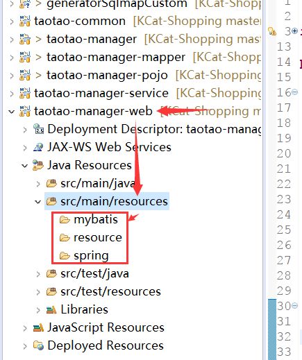
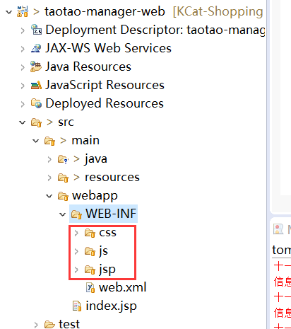
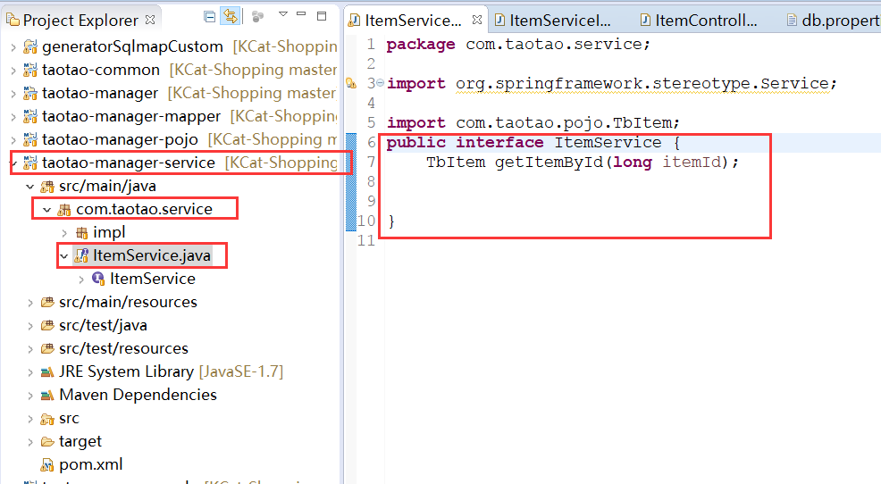
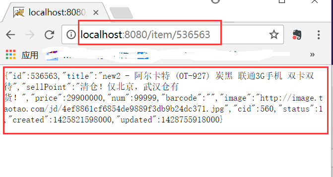

# ssm整合     

该文章在maven工程搭建完成的基础上编写，相关信息可查看本博客的前一篇文章。  

## 1.逆向工程   

逆向工程就是有人嫌pojo和xml文件的创建工作繁琐又机械，于是就用java程序根据数据库的字段，自动生成java和xml文件。   

### 1.导入逆向工程程序  

### 2.修改配置文件generatorConfig.xml   

1. 修改数据库连接的信息：驱动类、连接地址、用户名、密码  
2. pojo，mapper，接口生成的包名和位置   
3. 指定逆向的数据库表   

### 3.运行java程序      

### 4.将生成的文件拷贝到web程序的对应的模块的java文件夹下         

## 2.添加配置文件   

**配置文件**就是程序运行期间不断需要使用的定值，就像人的名字、性别、出生地一样。它一般呈key-value状态，寻找到java程序的与key对应的属性，提供value值。   

ssm框架搭建所需的配置文件放在manager-web的工程下面，因为它是war包格式，而其他的子模块是jar包格式。（tomcat不支持从jar包读取配置文件）      

按照规范，配置文件放在resources文件里面，再按技术架构新建子文件夹   

      

### 1.mybatis：

SqlMapConfig.xml文件（ 文件格式）

```xml
<?xml version="1.0" encoding="UTF-8" ?>
<!DOCTYPE configuration
		PUBLIC "-//mybatis.org//DTD Config 3.0//EN"
		"http://mybatis.org/dtd/mybatis-3-config.dtd">
<configuration>
	
</configuration>
```

缺失该文件会使程序报错   

### 2.spring：    

【DAO】applicationContext-dao.xml     (4.0约束基本格式)

```xml
<?xml version="1.0" encoding="UTF-8"?>
<beans xmlns="http://www.springframework.org/schema/beans"
	xmlns:context="http://www.springframework.org/schema/context" xmlns:p="http://www.springframework.org/schema/p"
	xmlns:aop="http://www.springframework.org/schema/aop" xmlns:tx="http://www.springframework.org/schema/tx"
	xmlns:xsi="http://www.w3.org/2001/XMLSchema-instance"
	xsi:schemaLocation="http://www.springframework.org/schema/beans http://www.springframework.org/schema/beans/spring-beans-4.0.xsd
	http://www.springframework.org/schema/context http://www.springframework.org/schema/context/spring-context-4.0.xsd
	http://www.springframework.org/schema/aop http://www.springframework.org/schema/aop/spring-aop-4.0.xsd http://www.springframework.org/schema/tx http://www.springframework.org/schema/tx/spring-tx-4.0.xsd
	http://www.springframework.org/schema/util http://www.springframework.org/schema/util/spring-util-4.0.xsd">

	<!-- 数据库连接池 -->
	<!-- 加载配置文件 -->
	<context:property-placeholder location="classpath:resource/db.properties" />
	<!-- 数据库连接池 -->
	<bean id="dataSource" class="com.alibaba.druid.pool.DruidDataSource"
		destroy-method="close">
		<property name="url" value="${jdbc.url}" />
		<property name="username" value="${jdbc.username}" />
		<property name="password" value="${jdbc.password}" />
		<property name="driverClassName" value="${jdbc.driver}" />
		<property name="maxActive" value="10" />
		<property name="minIdle" value="5" />
	</bean>
	<!-- 配置sqlsessionFactory -->
	<bean id="sqlSessionFactory" class="org.mybatis.spring.SqlSessionFactoryBean">
		<property name="configLocation" value="classpath:mybatis/SqlMapConfig.xml"></property>
		<property name="dataSource" ref="dataSource"></property>
	</bean>
	<!-- 配置扫描包，加载mapper代理对象 -->
	<bean class="org.mybatis.spring.mapper.MapperScannerConfigurer">
		<property name="basePackage" value="com.taotao.mapper"></property>
	</bean>
</beans>
```

1. 加载连接信息的配置文件resource/db.properties，修改class就可以配置连接池类型  

2. SqlSessionFactory配置

   SqlSessionFactory顾名思义就是用来提供各种方法来获取SqlSession。或配置Configuration。（feiman）   

   web模块依赖了一个SqlSessionFactoryBean.class的jar包，而该类的使用就需要为其配置信息：

   - SqlMapConfig.xml的配置文件    
   - 数据库连接信息，这里使用引用dataSource标签的方式：ref="dataSource"     

   SqlSessionFactory是mybatis的核心对象，applicationContext是spring的核心对象，在applicationContext中配置SqlSessionFactory就相当于把mybatis整合进了spring中，两者结合为一体。   

3. MapperScannerConfigurer的配置   

   使用mybatis-spring的扫描机制，告知MapperScannerConfigurer相关mapper接口的位置，如果将mapper.xml和mapper接口的没有放在一个目录，则需要在sqlMapConfig.xml中进行配置。  

   没有MapperScannerConfigurer的时候：

   1. 就需要先获取sqlSession对象： ``SqlSession sqlSession = sqlSessionFactory.openSession();``

   2. 根据sqlSession获取获取方法的对象：`` UserMapper userMapper = sqlSession.getMapper(UserMapper.class);``   

      载入接口，mybatis会根据接口名组合对应xml，自动生成mapper代理对象    

   使用MapperScannerConfigurer之后，只要写private UserMapper mapper并且添加@Autowired注解,就能直接获取到mapper对象   

   _比如我是mybatis，有一个用户要获取userMapper对象。他首先要跑到我们工厂，上交以个sqlSession申请单，然后我拿了个sqlSession给他，他再把接口放到sqlSession里，然后再拿给我，最后我才交出他要的userMapper对象。后来我们技术升级了，用户只要将userMapper对象的外壳放在家门口，用@Autowrite发一条短信给我，我们就会派快递员直接就把userMapper对象放进门口的容器里，大大提升了用户的体验感。_     

【Service】applicationContext-service.xml   

```xml
<?xml version="1.0" encoding="UTF-8"?>
<beans xmlns="http://www.springframework.org/schema/beans"
	xmlns:context="http://www.springframework.org/schema/context" xmlns:p="http://www.springframework.org/schema/p"
	xmlns:aop="http://www.springframework.org/schema/aop" xmlns:tx="http://www.springframework.org/schema/tx"
	xmlns:xsi="http://www.w3.org/2001/XMLSchema-instance"
	xsi:schemaLocation="http://www.springframework.org/schema/beans http://www.springframework.org/schema/beans/spring-beans-4.0.xsd
	http://www.springframework.org/schema/context http://www.springframework.org/schema/context/spring-context-4.0.xsd
	http://www.springframework.org/schema/aop http://www.springframework.org/schema/aop/spring-aop-4.0.xsd http://www.springframework.org/schema/tx http://www.springframework.org/schema/tx/spring-tx-4.0.xsd
	http://www.springframework.org/schema/util http://www.springframework.org/schema/util/spring-util-4.0.xsd">

	<!-- 扫描包加载Service实现类 -->
	<context:component-scan base-package="com.taotao.service"></context:component-scan>
</beans>
```

配置扫描包：添加注解要起效，需要知道注解在哪里，所以配置扫描包的位置   

【trans】applicationContext-trans.xml      

```xml
<?xml version="1.0" encoding="UTF-8"?>
<beans xmlns="http://www.springframework.org/schema/beans"
	xmlns:context="http://www.springframework.org/schema/context" xmlns:p="http://www.springframework.org/schema/p"
	xmlns:aop="http://www.springframework.org/schema/aop" xmlns:tx="http://www.springframework.org/schema/tx"
	xmlns:xsi="http://www.w3.org/2001/XMLSchema-instance"
	xsi:schemaLocation="http://www.springframework.org/schema/beans http://www.springframework.org/schema/beans/spring-beans-4.0.xsd
	http://www.springframework.org/schema/context http://www.springframework.org/schema/context/spring-context-4.0.xsd
	http://www.springframework.org/schema/aop http://www.springframework.org/schema/aop/spring-aop-4.0.xsd http://www.springframework.org/schema/tx http://www.springframework.org/schema/tx/spring-tx-4.0.xsd
	http://www.springframework.org/schema/util http://www.springframework.org/schema/util/spring-util-4.0.xsd">

	<!-- 事务管理器 -->
	<bean id="transactionManager"
		class="org.springframework.jdbc.datasource.DataSourceTransactionManager">
		<!-- 数据源 -->
		<property name="dataSource" ref="dataSource" />
	</bean>
	<!-- 通知 -->
	<tx:advice id="txAdvice" transaction-manager="transactionManager">
		<tx:attributes>
			<!-- 传播行为 -->
			<tx:method name="save*" propagation="REQUIRED" />
			<tx:method name="insert*" propagation="REQUIRED" />
			<tx:method name="add*" propagation="REQUIRED" />
			<tx:method name="create*" propagation="REQUIRED" />
			<tx:method name="delete*" propagation="REQUIRED" />
			<tx:method name="update*" propagation="REQUIRED" />
			<tx:method name="find*" propagation="SUPPORTS" read-only="true" />
			<tx:method name="select*" propagation="SUPPORTS" read-only="true" />
			<tx:method name="get*" propagation="SUPPORTS" read-only="true" />
		</tx:attributes>
	</tx:advice>
	<!-- 切面 -->
	<aop:config>
		<aop:advisor advice-ref="txAdvice"
			pointcut="execution(* com.taotao.service.*.*(..))" />
	</aop:config>
</beans>
```

1. 事务：这些操作要么都做，要么都不做，是一个不可分割的工作单位。   

2. 给DataSourceTransactionManager类配置数据源，管理事务（feiman）  

3. 指定拦截的方法名，事务的propagation：

   Required：必须在事务中执行   

   Supports：有事务就执行，没有就算   

4. 拦截的范围   

指定对哪个包的方法名进行拦截  

_我是一个事务管理器，我的工作就是将任务打包合并，一次完成。用户首先给我工作证：数据源，这样我就可以往数据库搬运数据了。但是有的任务需要合并，有的不需要，所以用户还会给我一个清单，上面指明我对该方法做不做打包工作。戴好工作牌，拿着清单，然后切面老司机aop专门载着我去往指定的位置工作。_    

【controller】springmvc.xml

```xml
<?xml version="1.0" encoding="UTF-8"?>
<beans xmlns="http://www.springframework.org/schema/beans"
	xmlns:xsi="http://www.w3.org/2001/XMLSchema-instance" xmlns:p="http://www.springframework.org/schema/p"
	xmlns:context="http://www.springframework.org/schema/context"
	xmlns:mvc="http://www.springframework.org/schema/mvc"
	xsi:schemaLocation="http://www.springframework.org/schema/beans http://www.springframework.org/schema/beans/spring-beans.xsd
        http://www.springframework.org/schema/mvc http://www.springframework.org/schema/mvc/spring-mvc-4.0.xsd
        http://www.springframework.org/schema/context http://www.springframework.org/schema/context/spring-context.xsd">

	<context:component-scan base-package="com.taotao.controller" />
	<mvc:annotation-driven />
	<bean
		class="org.springframework.web.servlet.view.InternalResourceViewResolver">
		<property name="prefix" value="/WEB-INF/jsp/" />
		<property name="suffix" value=".jsp" />
	</bean>
</beans>
```

1. 配置包扫描器，告诉Controller对象的位置         
2. 设置前缀和后缀   
3. 开启注解驱动  

_我叫视图解析器，是一位指路人。一个数据部落和我签下契约之后，每次该部落有数据被return派遣去前端世界的时候，我就会告诉他们开头怎么走prefix，结尾怎么走suffix。和他们自己想去的地方的地图一拼凑，就能顺利到达目的地。_   

### 3.resource：其他配置文件  

1. db.properties数据库连接信息     

   ```xml
   jdbc.url=com.mysql.jdbc.Driver
   jdbc.username=jdbc:mysql://localhost:3306/taotao?characterEncoding=utf-8
   jdbc.password=root
   jdbc.driver=123456
   ```

   编写的时候用``key=value``的方式，抽取的时候用``	<context:property-placeholder location="classpath:resource/db.properties" />``加载配置文件，``${jdbc.url}``取值。   

### 4.web.xml   

修改web.xml文件   

```xml
<?xml version="1.0" encoding="UTF-8"?>
<web-app xmlns:xsi="http://www.w3.org/2001/XMLSchema-instance"
	xmlns="http://java.sun.com/xml/ns/javaee" xmlns:web="http://java.sun.com/xml/ns/javaee/web-app_2_5.xsd"
	xsi:schemaLocation="http://java.sun.com/xml/ns/javaee http://java.sun.com/xml/ns/javaee/web-app_2_5.xsd"
	id="taotao" version="2.5">
	<display-name>taotao-manager</display-name>
	<welcome-file-list>
		<welcome-file>index.html</welcome-file>
		<welcome-file>index.htm</welcome-file>
		<welcome-file>index.jsp</welcome-file>
		<welcome-file>default.html</welcome-file>
		<welcome-file>default.htm</welcome-file>
		<welcome-file>default.jsp</welcome-file>
	</welcome-file-list>
	<!-- 加载spring容器 -->
	<context-param>
		<param-name>contextConfigLocation</param-name>
		<param-value>classpath:spring/applicationContext-*.xml</param-value>
	</context-param>
	<listener>
		<listener-class>org.springframework.web.context.ContextLoaderListener</listener-class>
	</listener>
	<!-- 解决post乱码 -->
	<filter>
		<filter-name>CharacterEncodingFilter</filter-name>
		<filter-class>org.springframework.web.filter.CharacterEncodingFilter</filter-class>
		<init-param>
			<param-name>encoding</param-name>
			<param-value>utf-8</param-value>
		</init-param>
	</filter>
    <!-- 拦截所有请求进行过滤 -->
	<filter-mapping>
		<filter-name>CharacterEncodingFilter</filter-name>
		<url-pattern>/*</url-pattern>  
	</filter-mapping>
	<!-- springmvc的前端控制器 -->
	<servlet>
		<servlet-name>taotao-manager</servlet-name>
		<servlet-class>org.springframework.web.servlet.DispatcherServlet</servlet-class>
		<!-- contextConfigLocation不是必须的， 如果不配置contextConfigLocation， springmvc的配置文件默认在：WEB-INF/servlet的name+"-servlet.xml" -->
		<init-param>
			<param-name>contextConfigLocation</param-name>
			<param-value>classpath:spring/springmvc.xml</param-value>
		</init-param>
		<load-on-startup>1</load-on-startup>
	</servlet>
	<servlet-mapping>
		<servlet-name>taotao-manager</servlet-name>
		<url-pattern>/</url-pattern> <!--拦截所有请求，不能用/* -->
	</servlet-mapping>
</web-app>
```

web.xml文件是用来初始化配置信息：比如Welcome页面、servlet、servlet-mapping、filter、listener、启动加载级别等。  

1. Listener  

   Listener可以监听客户端的请求、服务端的操作等。通过监听器，可以自动激发一些操作，比如监听在线的用户的数量。  通俗的语言说就是在application，session，request三个对象创建消亡或者往其中添加修改删除属性时自动执行代码的功能组件。

2. servlet会拦截所有的文件，由于静态资源被servlet拦截，所以需要在springmvc.xml中添加资料映射，才可以被正常访问。      

```xml
<!-- 资源映射 -->
	<mvc:resources location="/WEB-INF/css/" mapping="/css/**"/>
	<mvc:resources location="/WEB-INF/js/" mapping="/js/**"/>
```

_web.xml像一个管理员，管控着框架的启动运行。_  

## 3.添加静态文件   

将静态文件复制到WEB-INF文件夹下面。

    

## 4.测试部署  

### 1.service层的抽象接口

在manager-service包下新建抽象接口，为的是便于扩展    

  

_架构师写一行字：“获取全部信息方法”（编写接口），开发人员就根据这行字把功能实现出来_       

### 2.service层的实现接口   

在manager-service包下新建impl文件夹，把接口的实现方法写在里面      

_目的是为了整齐规范，一般我们只需要看到外面的接口内容，而需要知道详情的时候才点进impl文件夹去看_    

实现该接口还需要添加``@Service``，告诉容器，这是一个Service。如果用到Mapper接口的方法，则需要用``@Autowired``把Mapper注入进来。  

eg:

```java
@Service
public class ItemServiceImpl implements ItemService{	
	@Autowired
	private TbItemMapper itemMapper;
	@Override
	public TbItem getItemById(long itemId){
		TbItemExample example = new TbItemExample();
		//添加查询条件
		Criteria criteria = example.createCriteria();
		criteria.andIdEqualTo(itemId);	
		List<TbItem> list = itemMapper.selectByExample(example);
		if(list != null && list.size() > 0){
			TbItem item = list.get(0);
			return item;
		}
		return null;
	}
}
```

_实现service抽象方法，调用底层的方法需要注入_   

### 3.controller层调用

在manager-controller包下新建controller类

首先要添加``@Controller``,告诉系统这是Controller。而要使用Service的方法就要把Service注入进来。···

```java
@Controller
public class ItemController {
	@Autowired
	private ItemService itemService;
	
	@RequestMapping("/item/{itemId}")
	@ResponseBody
	public TbItem getItemById(@PathVariable Long itemId){
		TbItem tbItem = itemService.getItemById(itemId);
		return tbItem;
	}
}
```

_Controller和Service基本归纳为：介绍自己，注入底层，调用上一层方法_     

当mapper使用``@RequestMapping("/item/{itemId}")``注解的时候，说明前端把itemId作为参数传了过来，在参数列表中添加``@PathVariable Long itemId``进行接收   

而当要返回内容的时候，需要添加``@ResponseBody``告诉系统进行返回了信息。   

  
