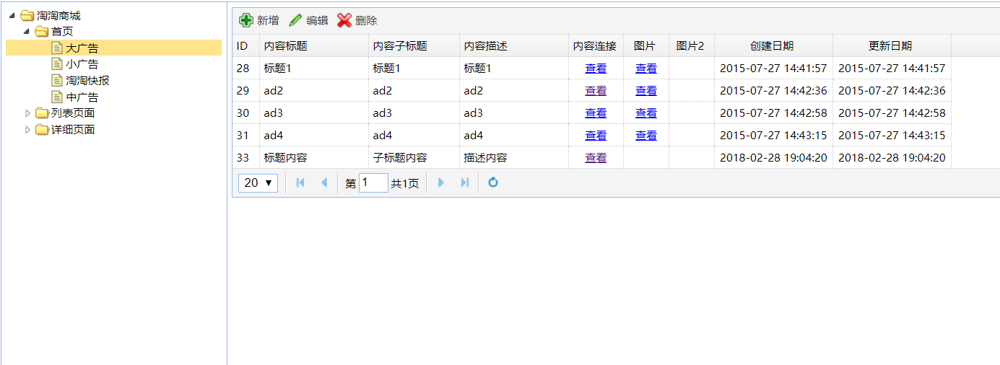

# CMS系统   

D:

```java
	public List<EUTreeNode> getCategoryList(long parentId) {
		//根据parentId查询节点列表
		TbContentCategoryExample example = new TbContentCategoryExample();
		Criteria criteria = example.createCriteria();
		criteria.andParentIdEqualTo(parentId);
		//执行查询
		List<TbContentCategory> list = contentCategoryMapper.selectByExample(example);
		List<EUTreeNode> resultList = new ArrayList<>();
		for (TbContentCategory tbContentCategory : list) {
			//创建节点
			EUTreeNode node = new EUTreeNode();
			node.setId(tbContentCategory.getId());
			node.setText(tbContentCategory.getName());
			node.setState(tbContentCategory.getIsParent()?"closed":"open");
			
			resultList.add(node);
		}
		return resultList;
	}
```

M:``		List<TbContentCategory> list = contentCategoryMapper.selectByExample(example);``查询到的list是什么东西？

Z:Service层


M:也就是说，如果parentId = 30，我可能会查到   首页，列表页面，详细页面   三个模块  。那这三个模块同一个parentId是有什么共同处呢？

D:这需要结合Controller来看：

```java
	@RequestMapping("/list")
	@ResponseBody
	public List<EUTreeNode> getContentCatList(@RequestParam(value="id",defaultValue="0")Long parentId){
		List<EUTreeNode> list = contentCategoryService.getCategoryList(parentId);
		return list;
	}
```

Z:``@RequestParam(value="id",defaultValue="0")Long parentId``  

- 通过@PathVariable，例如/blogs/1
- 通过@RequestParam，例如blogs?blogId=1

当前台传来的与参数列表相同，为parentId，可以不用@RequestParam注解。而RequestParam注解还可以添加默认值。    

M:所以说，它第一次默认为parentId=0，根据数据库可以知道取到 _淘淘商城_ 这个节点，而当点击  _淘淘商城_  时，它的id=30就作为parentId传到Controller，从而获得 _首页_ ，_列表页面_ ，_详细页面_  三个节点，以此类推构成以下动态加载的树状图。

  

M:那它是怎么以json的形式返回前端的呢？

Z:EUTreeNode是专门为了eTree而准备的model，这个model组成一个List，只要配合``@ResponseBody``的使用，就能返回为json数据。

【ResponseBody】一般在异步获取数据时使用，在使用``@RequestMapping``后，返回值通常解析为跳转路径，加上``@Responsebody``后返回结果不会被解析为跳转路径，而是直接写入HTTP response body中。比如异步获取json数据，加上@responsebody后，会直接返回json数据。  

  

D:

```xml
  <insert id="insertSelective" parameterType="com.taotao.pojo.TbContentCategory">
    <selectKey keyProperty="id" resultType="long" order="AFTER" useGeneratedKeys="true">
    	SELECT LAST_INSERT_ID()
    </selectKey>
    insert into tb_content_category
    <trim prefix="(" suffix=")" suffixOverrides="," >
      <if test="id != null" >
        id,
      </if>
      <if test="parentId != null" >
        parent_id,
      </if>
...
```

```java
	public TaotaoResult insertContentCategory(long parentId, String name) {	
		//创建pojo
		TbContentCategory contentCategory = new TbContentCategory();
		contentCategory.setName(name);   //设置主键返回
		contentCategory.setIsParent(false);  //新的叶子节点
		contentCategory.setStatus(1);  //1 正常   2 删除
		contentCategory.setParentId(parentId);
		contentCategory.setSortOrder(1);
		contentCategory.setCreated(new Date());
		contentCategory.setUpdated(new Date());
		//添加记录到数据库中
		contentCategoryMapper.insert(contentCategory);
		//查看父节点的isParent是否为true
		TbContentCategory parentCat = contentCategoryMapper.selectByPrimaryKey(parentId);
		//判断是否为true
		if(!parentCat.getIsParent()){
			parentCat.setIsParent(true);
			//更新父节点
			contentCategoryMapper.updateByPrimaryKey(parentCat);
		}
		return TaotaoResult.ok(contentCategory);
	}
```

M:

```java
    <selectKey keyProperty="id" resultType="long" order="AFTER">
    	SELECT LAST_INSERT_ID()
    </selectKey>
```

这个是用来干嘛的？

Z:它可以做在 keyProperty="id"列返回插入后生成的id值，order="AFTER"表示在执行sql之后。

而他返回的id值不需要进行获取，会自动添加到``contentCategoryMapper.insert(contentCategory);``的contentCategory中。

M:那这一段的作用是什么？

```java
		//查看父节点的isParent是否为true
		TbContentCategory parentCat = contentCategoryMapper.selectByPrimaryKey(parentId);
		//判断是否为true
		if(!parentCat.getIsParent()){
			parentCat.setIsParent(true);
			//更新父节点
			contentCategoryMapper.updateByPrimaryKey(parentCat);
		}
```

Z:因为在一个叶子节点下一级添了一个叶子节点，所以原先的叶子节点就变成父节点，所以需要改变其父节点的``IsParent``为true，说明它是父节点。

M:那判断是不是父节点的作用无非就是节省``updateByPrimaryKey``的次数咯。

M:为什么每次都要返回生成的id呢？

D:Controller中

```java
	@RequestMapping("/create")
	@ResponseBody	
	public TaotaoResult createContentCategory(Long parentId,String name){
		TaotaoResult result = contentCategoryService.insertContentCategory(parentId, name);
		return result;
	}
```

Z:因为他新增叶子节点调用Controller的时候需要传父id过来，还有新增的名字。而返回的id其实就会成为它子节点的parentId，拥有  父节点的id + 名字  就可以生成一个子节点了。

M:那``SortOrder``是干嘛用的？

Z:表示同级类目的展现次序，如数值相等则按名称次序排列。取值范围:大于零的整数。

D:

```java
	@Override
	public TaotaoResult deleteByPrimaryKey(long id, long parentId) {
		//删除记录
		contentCategoryMapper.deleteByPrimaryKey(id);
		//判断是否父节点是否变空
		TbContentCategoryExample example = new TbContentCategoryExample();
		Criteria criteria = example.createCriteria();
		criteria.andParentIdEqualTo(parentId);
		List<TbContentCategory> list = contentCategoryMapper.selectByExample(example);
		if(list.size()==0){    //子节点为空
			TbContentCategory parentCat = contentCategoryMapper.selectByPrimaryKey(parentId);
			parentCat.setIsParent(false);
		}
		return TaotaoResult.ok();
	}
```

M:能解释下获取值的过程吗？

```java
		TbContentCategoryExample example = new TbContentCategoryExample();
		Criteria criteria = example.createCriteria();
		criteria.andParentIdEqualTo(parentId);
		List<TbContentCategory> list = contentCategoryMapper.selectByExample(example);
```

Z:这是该逆向工程数据库的查询过程。

​	工具:首先需要一个**example**，通过example创建一个**criteria**，注入一个**mapper**对象。

​	过程:criteria用来存值，example作为mapper对象方法的值。

M:为什么删除旧的树节点时，传过来的parentId为空，而数据库却已有该字段？

Z:这个涉及到eTree创建的方式，到时再研究，目前还是不知道，有其他人知道吗？

D:eTree配合Dategrid显示，这里主要是pageHelper的使用。

  

```java
	public EUDataDridResult getContentList(int page, int rows, long categoryId) {
		
		TbContentExample example = new TbContentExample();
		//分页处理   
		PageHelper.startPage(page, rows);
		Criteria criteria = example.createCriteria();
		criteria.andCategoryIdEqualTo(categoryId);
		List<TbContent> list = contentMapper.selectByExample(example);   
		
		//创建返回值对象   
		EUDataDridResult result = new EUDataDridResult();
		result.setRows(list);
		//取分页信息
		PageInfo<TbContent> pageInfo = new PageInfo<>(list);
		result.setTotal(pageInfo.getTotal());
		return result;
	}
```

M:``PageHelper.startPage(page, rows);``在这里的作用是什么？

Z:这是分页插件的方法

1. ``PageHelper.startPage(page, rows);``告诉插件查询第几页，多少条数据.
2. 则获取当前的总条数

```java
		PageInfo<TbContent> pageInfo = new PageInfo<>(list);
		result.setTotal(pageInfo.getTotal());
```

M:那为什么要把数据放进``EUDataDridResult``里呢？

D:``EUDataDridResult`` 的pojo

```java
public class EUDataDridResult {
	private long total;
	private List<?> rows;
  ...
```

Z:``EUDataDridResult``存放的是 列信息 和 数据的长度，当它返回给datagrid的时候，datagrid就会根据该pojo将数据进行显示。

M:那`` long categoryId``的作用是？

Z:因为是树节点，eTree每点击一下就会把``categoryId``作为参数传给Controller。

D:返回状态处理Controller

```java
	@RequestMapping("/list/{contentCategoryId}")
	@ResponseBody
	public TaotaoResult getContentList(@PathVariable Long contentCategoryId){
		try {
			List<TbContent> list = contentService.getContentList(contentCategoryId);
			return TaotaoResult.ok(list);
		} catch (Exception e) {
			e.printStackTrace();
			return TaotaoResult
					.build(500, ExceptionUtil.getStackTrace(e));  //出错状态码,错误消息 
		}
	}
```

M:为什么要包try...catch

Z:获取可能失败，所以要对过程捕捉异常处理。

M:那``return TaotaoResult.ok(list);``的list作用是什么？

D:ok()方法

```java
    public static TaotaoResult ok(Object data) {
        return new TaotaoResult(data);
    }
    public TaotaoResult(Object data) {
        this.status = 200;
        this.msg = "OK";
        this.data = data;
    }
```

Z:当我们返回ok方法时，他就会将 **list + 状态码 + 状态信息 ** 进行返回

M:那build方法``return TaotaoResult.build(500, ExceptionUtil.getStackTrace(e)); `` 呢？

D:build()方法 

```java
    public static TaotaoResult build(Integer status, String msg) {
        return new TaotaoResult(status, msg, null);
    }
```

Z:与ok()方法相似, 区别就是build()方法的状态码和状态信息由自己手动添加。

M:但是状态信息要怎么写呢，状态码对应的状态信息我也不清楚呢？

Z:所以这里提供了工具类``ExceptionUtil``，用来返回状态信息：``ExceptionUtil.getStackTrace(e)``。

D:其实也不过是控制台的信息toString返回而已

```java
	public static String getStackTrace(Throwable t) {
		StringWriter sw = new StringWriter();
		PrintWriter pw = new PrintWriter(sw);

		try {
			t.printStackTrace(pw);
			return sw.toString();
		} finally {
			pw.close();
		}
	}
```

D:


首页广告列表获取

节点管理：

​	添加节点实现，插入到数据库

​	删除节点

​	修改节点

内容管理


HttpClient


dzm分析

看一部分，做一部分

09  视频做